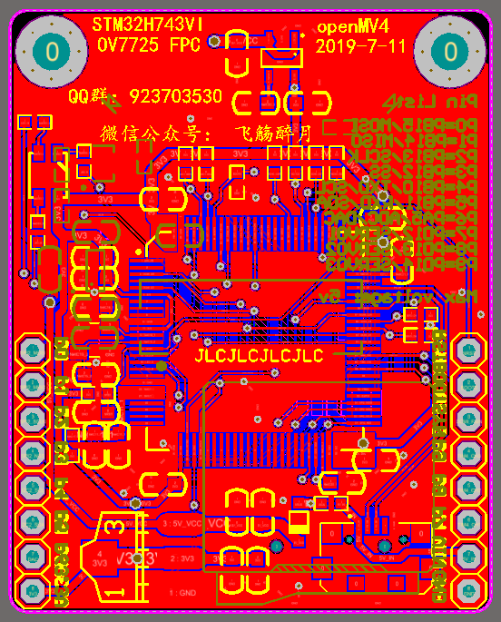

# OpenMVX
**a customized openmv camera,based on the openmv camera.**
**now only STM32H743+OV7725 FPC version (openMV4)**

## license

**OpenMVX is licensed under the GNU General Public Licence (GPL)V3.0**

**注意，此repository下开源的所有文件使用GPL V3.0协议，如果你用了这里的文件，那么你也要开源你的设计（也必须使用GPL协议）**

个人定制版openmv，使用官方原版openmv4硬件文件修改而来，三次打样（修改两次）后实现全部功能，使用国内常用元件，保证都是淘宝容易买到的，并且简化一部分电路设计，去掉BTB接口，直接单板实现，使用FPC镜头，焊接个FPC座就行，免得焊BGA的感光元件，现在只有STM32H743VIT6+OV7725（FPC小镜头），一体化设计，兼容原版尺寸接口，去掉不必要的SWD接口，OV7725独立供电，大部分功能已验证过（包括摄像头、TF卡、串口、SPI屏幕、当然肯定有USB连接上位机），在电赛时也使用过，好几个月了没出过问题。

没有key，即“盗版 openmv”，除每次弹窗外不影响使用，固件使用DFU刷入，SWD是没有用的，所以去掉了。
给出原理图、PCB、PCB工程文件、集成封装库等硬件全部文件，Altium Designer 16格式（AD16）。
（使用原版openmv二次修改而来，已包含原版openmv的license文件：master/openmv LICENSE.txt）

## 怎么烧固件：

我已经录制了烧录固件教程，每一步都有说明，视频链接：

https://www.bilibili.com/video/BV1Gy4y1q7NB/

4K分辨率，有字幕有链接

## 高频问题解答：  

### 为什么MCU两颗LDO供电？

**习惯而已，一颗也行，OV7725也可以公用，整个PCB就一个3.3V的LDO也行，只要电流够用。**    

### 是几层板？

**两层板常规工艺，走到哪都不用加钱的那种。**（客编我都给你放好了，下单掏5块钱就行）

### DFU烧录固件卡在66%？

**这不是个例，我用的是硬件版本Y的芯片烧录固件完全正常，硬件版本V的芯片出现此问题，原因尚不清楚。目前（2019年底以后）市面上基本没有Y版本的芯片了，解决办法由群友提供，群友在2020-3-18上传的PDF有详细教程，好几个群友已经DIY成功。**

烧录固件视频教程近期将更新，敬请期待

### 引出排针有个空脚？

**那是外部帧同步信号，BGA的OV7725有，FPC的OV7725没有这个引脚，为了与OpenMV官方版引脚兼容，此引脚悬空。**

### 元件在哪买？ 

**已更新了带淘宝链接的BOM，仅供参考，购买后果自行承担。摄像头搜索关键词“OV7725 FPC”，我用的是长度21mm的**

### 关于FPC座子的封装？ 

**我使用24pin FPC座的封装1号脚在右侧，而OV7725的1号脚在左侧，所以在Pin map里将引脚映射反向，这样引脚顺序就对了。（前提是FPC座是翻盖下接），直接打板是肯定没问题的。**

**详细讲解请看：关于pin map.md**

## 预览PCB

## 实拍效果

## about

**有任何技术问题，可加QQ群 923703530**

**更多技术分享和作品开源分享，可关注微信公众号： 飞觞醉月**    

