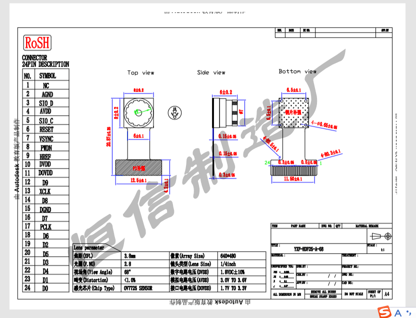
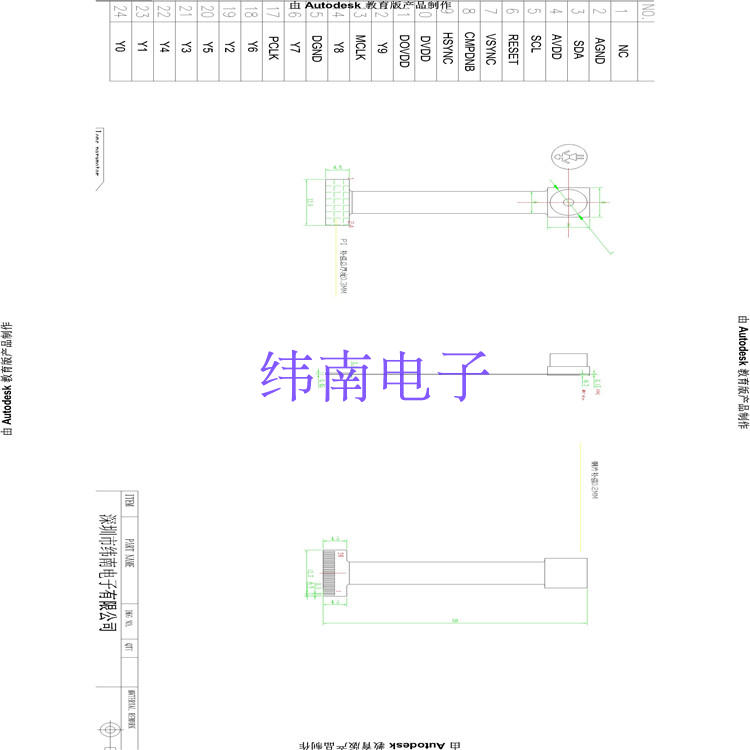
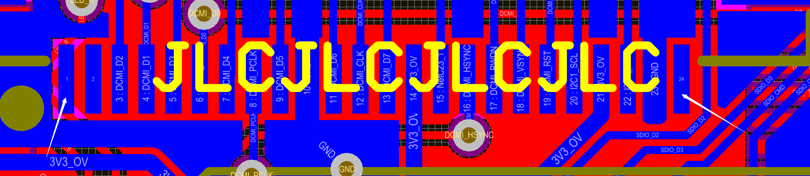
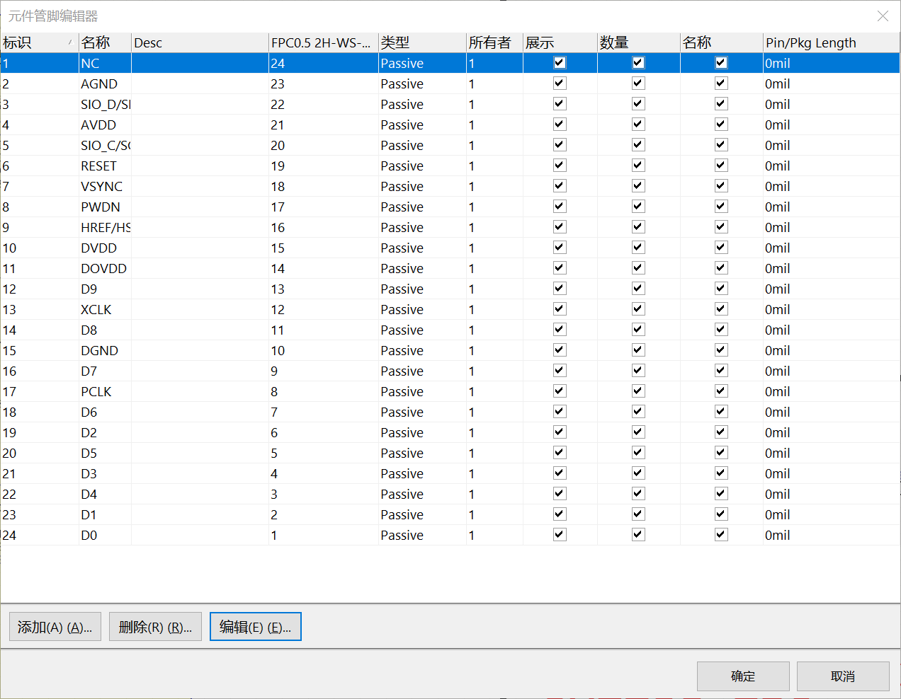
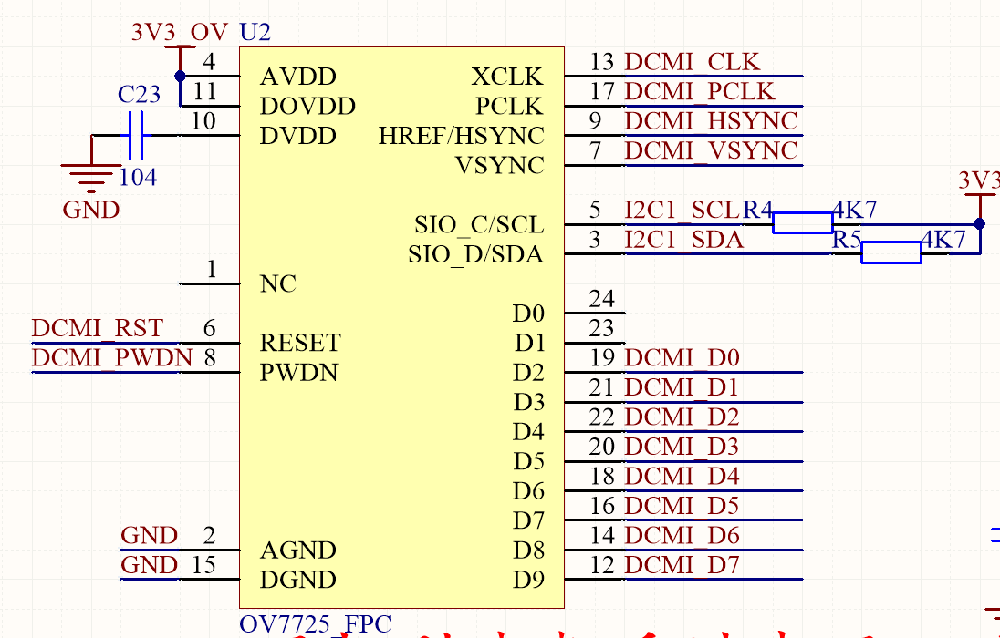
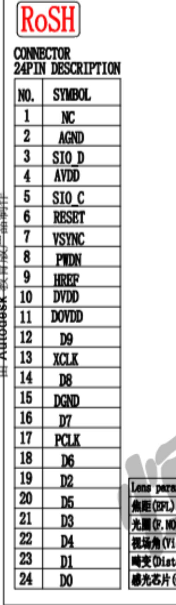
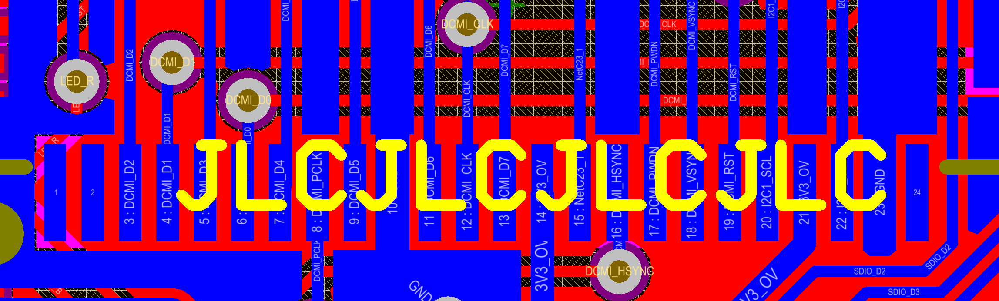

# 关于pin remap

## 起因

下面是两个从淘宝OV7725详情页拿到的引脚定义，请观察**OV7725的1号脚在哪边？**

在两个图片中，都有正视（摄像头向上，图左）、侧视（图中）、后视（图右）

标有引脚序号的都是后视图，并且在后视图中1号脚在右边

所以，OV7725在**正视图中，1号脚在左边**

下面再看我的FPC座子封装：

请注意观察白色箭头处

在bottom layer，1号脚在左边，所以当正视时，FPC座子的1号脚在右边

刚好和OV7725的**引脚顺序相反**

（注意这里是顺序相反，而不是仅有1和24反了，真的有人认为只有1和24）

## 解决办法

因为现有的封装的1号脚和OV7725图里的是反的（这代表从1到24都是反的，而不是只有1和24！！！！！！！！！！）所以我们要将所有引脚反向连接（而不是交换1和24），或者手动画一个新的FPC封装！

我选择了**引脚反向连接**

也就是在pin map里面修改

双击原理图中的OV7725，点击edit pins，出现这个窗口：

你可以发现，我把1到24反过来对应了（**注意第一列和第四列**），也就是前面说的反向连接，解决了FPC封装1号引脚和OV7725不一样的问题，但也让我多花了n个小时用于向n个人解释n遍（所以又更新了这个文章）

## 验证结果

下面来验证这一做法是否有效，

下面两个图分别是我画的原理图库和OV7725规格书中的引脚定义，

请观察**二者是否一致（序号以及对应的名字）**

原理图检查无误，下面检查PCB，

由于**DCMI的连接是忽略低位信号线**，所以我们只判断顺序是否反了，不判断具体接线（PCB中只显示焊盘连接的net名字而不显示它的原理图的引脚的名字，比如原理图封装的AVDD实际在PCB中显示它连接的3V3_OV这个net）

二者都选择背面的视图

从背面看：OV7725左边24脚，应该是放了一堆数据线，在原理图中我们悬空了两个，剩下的数据线都连了，OV7725右边1号脚悬空，2号脚GND，3号脚名字SIO_D连接的是SDA

从背面看：

FPC左边1,2脚，悬空了，然后是一堆数据线，FPC右边1个悬空，1个GND，1个SDA

对比PCB和OV7725的规格书，二者1号脚位置不同，但接线却是对的，验证了pin map的有效性

同时我们也可以总结出，AD的pin map只改变net的连接，而不改变你在PCB中看到的引脚序号

最后还是那句话：不动手只看教程是学不会的